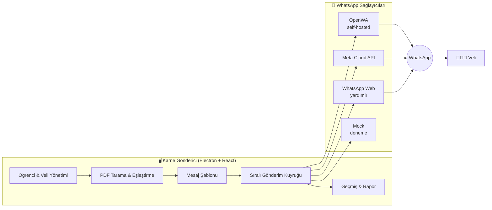

<div align="center">

# 📨 Karne Gönderici

### Haftalık sınav karnelerini velilere WhatsApp'tan, **tek dakikada** ve **doğru kişiye** ulaştırın.

macOS için sade, hızlı ve hata toleranslı bir masaüstü yardımcı aracı.

<br />


<br />

<!-- 📸 Ekran görüntüsü ekleyin: docs/screenshots/hero.png -->
<!--  -->

</div>

---

## ✨ Neden Karne Gönderici?

Her hafta onlarca PDF'i tek tek açıp, doğru veliyi bulup, WhatsApp'ta tek tek göndermek hem **zaman kaybı** hem de **yanlış kişiye gönderme riski**.

Karne Gönderici bu işi üç adıma indirir:

> **1. Klasörü seç → 2. Eşleşmeleri gözden geçir → 3. Gönder.**

Gerisini uygulama halleder: dosya adlarını okur, öğrencilerle eşleştirir, mesajı kişiselleştirir, sırayla gönderir ve her adımı kayda geçirir.

---

## 🎯 Özellikler

<table>
<tr>
<td width="50%" valign="top">

### 🧠 Akıllı PDF Eşleştirme
`Ahmet Yılmaz.pdf`, `Ahmet_Yilmaz.pdf`, `ahmet-yilmaz-haftalik.pdf`… Türkçe karakterleri (`ç ğ ı ö ş ü`) normalize ederek dosyaları öğrencilerle otomatik eşleştirir. Güven skoru düşük eşleşmeler onayınıza sunulur.

</td>
<td width="50%" valign="top">

### 🔎 İçerikten Eşleştirme
Dosya adı anlamsızsa (`scan_001.pdf`) PDF'in **metin katmanı** okunarak öğrenci adı bulunur. Bulunamayanlar için manuel **"Ata / Değiştir"** penceresi vardır.

</td>
</tr>
<tr>
<td width="50%" valign="top">

### 🛡️ Hata İzolasyonu
Bir öğrencinin gönderimi başarısız olsa bile kuyruk durmaz. Başarısızlar için otomatik yeniden deneme ve tek tıkla **"Tekrar Dene"** vardır.

</td>
<td width="50%" valign="top">

### ⏱️ Sıralı & Güvenli Gönderim
Mesajlar arka arkaya basılmaz; öğrenciler arasına ayarlanabilir bekleme konur. **Duraklat**, **iptal** ve uygulama kapanırsa **kaldığı yerden devam** desteklenir.

</td>
</tr>
<tr>
<td width="50%" valign="top">

### ✍️ Mesaj Şablonları
Hazır şablonlar ve dinamik değişkenler:
`{veli_adi}` `{ogrenci_adi}` `{sinif}` `{tarih}` `{gun}` `{sinav_adi}` `{okul_adi}` …
Göndermeden önce canlı önizleme görürsünüz.

</td>
<td width="50%" valign="top">

### 🗓️ Zamanlanmış Gönderim
Gönderimi belirli bir tarih ve saate planlayın; zamanı gelince sesli bildirimle başlar.

</td>
</tr>
<tr>
<td width="50%" valign="top">

### 👥 Öğrenci Yönetimi
Excel'den toplu içe aktarma, sınıf/şube/grup filtresi, telefon doğrulama ve normalizasyon, mükerrer kayıt tespiti, JSON yedekleme.

</td>
<td width="50%" valign="top">

### 📊 Geçmiş & Raporlar
Her gönderim kayıt altındadır. **Excel raporu** alabilir veya imzaya hazır **Teslim Tutanağı** yazdırabilirsiniz.

</td>
</tr>
</table>

<div align="center">

🌗 Açık / Koyu tema &nbsp;•&nbsp; 🔔 Sesli bildirim &nbsp;•&nbsp; 👁️ PDF önizleme &nbsp;•&nbsp; 🧪 Test mesajı &nbsp;•&nbsp; 🎭 Mock (deneme) modu

</div>

---

## 🏗️ Mimari



Sağlayıcılar ortak bir arayüzü (`WhatsAppProvider`) uygular; böylece gönderim kuyruğu hangi servisin kullanıldığından bağımsız çalışır.

| Sağlayıcı | Ne zaman? | Not |
|---|---|---|
| **OpenWA** | Varsayılan, kendi sunucunuz | Docker ile yerelde çalışır, QR ile bağlanır |
| **Meta Cloud API** | Resmi API istiyorsanız | Token ve Phone Number ID gerekir |
| **WhatsApp Web** | Hızlı, yardımlı kullanım | Sohbeti açar; PDF'i elle eklersiniz |
| **Mock** | Deneme ve eğitim | Hiçbir şey gerçekten gönderilmez |

---

## 🚀 Hızlı Başlangıç

### Gereksinimler
- macOS (Apple Silicon için paketlenir)
- [Node.js](https://nodejs.org) 20+
- [Docker](https://www.docker.com/products/docker-desktop/) (OpenWA için)

### 1️⃣ OpenWA servisini başlatın

```bash
docker run -d \
  --name openwa \
  -p 127.0.0.1:2785:2785 \
  -v openwa_data:/app/data \
  rmyndharis/openwa:latest
```

> 💡 `127.0.0.1:` öneki, servisin yalnızca bu bilgisayardan erişilebilir olmasını sağlar.

### 2️⃣ Uygulamayı çalıştırın

```bash
git clone https://github.com/batuhanarici/Vatsap.git
cd Vatsap
npm install
npm run dev
```

Tarayıcıda `http://localhost:3000` adresini açın. Masaüstü penceresi için ikinci bir terminalde:

```bash
npm run electron:start
```

### 3️⃣ İlk kullanım

| Adım | Ne yapılır? |
|:---:|---|
| **1** | ⚙️ **Ayarlar**'dan OpenWA API anahtarını girin ve QR kodu telefonunuzdaki WhatsApp ile okutun |
| **2** | 👥 **Öğrenciler** sekmesinden Excel listenizi içe aktarın |
| **3** | 📁 Karne PDF'lerinin bulunduğu klasörü seçin *(denemek için **Örnek PDF'leri Yükle**)* |
| **4** | ✅ Eşleştirme tablosunu gözden geçirin, şüpheli satırları düzeltin |
| **5** | 🚀 Mesaj önizlemesini kontrol edip **Gönderime Başla**'ya basın |

> 🧪 **İpucu:** Gerçek velilere göndermeden önce **Mock modu** ve **Test mesajı** ile tüm akışı kendi numaranızda deneyin.

### Excel şablonu

| Sınıf / Şube | Öğrenci Adı | Veli Adı | WhatsApp Telefon |
|---|---|---|---|
| 8-A | Ali Yılmaz | Mehmet Yılmaz | 0532 111 22 33 |
| 8-B | Ayşe Demir | Fatma Demir | 0533 222 33 44 |

Uygulama içinden **"Örnek Excel İndir"** ile hazır şablonu alabilirsiniz. Telefon numaraları `905XXXXXXXXX` biçimine otomatik dönüştürülür.

---

## 📦 macOS Uygulaması Olarak Derleme

```bash
npm run build:mac:dmg
```

Çıktı `release/` klasörüne yazılır. Ayrıntılar için: [`docs/MACOS_BUILD.md`](docs/MACOS_BUILD.md)

> ⚠️ Uygulama şu an **ad-hoc imzalıdır** (noter onayı yok). Başka bir Mac'te ilk açılışta *Sistem Ayarları → Gizlilik ve Güvenlik* üzerinden izin vermeniz gerekebilir.

---

## 🗂️ Proje Yapısı

```text
Vatsap/
├── electron/                 # Ana süreç ve preload (dosya diyaloğu, güvenli depolama köprüsü)
├── server.ts                 # Geliştirme sunucusu + OpenWA proxy (web modu)
├── src/
│   ├── App.tsx               # Ana akış ve durum yönetimi
│   ├── components/           # Arayüz bileşenleri (tablolar, modallar, ayarlar)
│   ├── services/
│   │   ├── normalizer.ts     # Türkçe metin ve telefon normalizasyonu
│   │   ├── pdfMatcher.ts     # Dosya adı ↔ öğrenci eşleştirme
│   │   ├── pdfTextExtractor.ts  # PDF metin katmanından eşleştirme
│   │   ├── senderQueue.ts    # Sıralı gönderim, yeniden deneme, devam etme
│   │   ├── templateService.ts   # Mesaj değişkenleri
│   │   ├── reportExportService.ts  # Excel raporu ve teslim tutanağı
│   │   └── whatsapp/         # OpenWA · Meta Cloud · WhatsApp Web · Mock
│   └── types/
└── docs/                     # OpenWA ve macOS derleme rehberleri
```

---

## ⚠️ Bilinen Sınırlamalar ve Yol Haritası

Bu proje aktif geliştirme aşamasındadır. **Gerçek velilere göndermeden önce** aşağıdakileri bilmeniz önemlidir:

- [ ] 🔴 Electron modunda seçilen klasörden PDF içeriğinin okunması tamamlanmalı (gönderimden önce **mutlaka Mock/Test ile doğrulayın**)
- [ ] 🔴 Eşleştirme eşiği sıkılaştırılmalı; gönderim öncesi **eşleşme listesini gözle kontrol edin**
- [ ] 🔴 Electron IPC yetkileri daraltılmalı, rapor çıktısındaki HTML kaçışlanmalı
- [ ] 🟠 API anahtarlarının `safeStorage` ile şifrelenmesi
- [ ] 🟠 Zamanlanmış gönderimin güvenilirliği ve kardeş öğrencilerde mükerrer koruması
- [ ] 🟡 Bağımlılık güncellemeleri (`electron`, `xlsx`), yazı tipi ve PDF çalışanının pakete dahil edilmesi
- [ ] 🟡 Birim testleri (`normalizer`, `pdfMatcher`, `templateService`)
- [ ] 🟡 Erişilebilirlik (ARIA, odak yönetimi, daha okunaklı yazı boyutları)
- [ ] 🔵 Noter onaylı (notarized) macOS dağıtımı

### 📱 WhatsApp kullanımı hakkında
- **OpenWA** resmî olmayan bir yöntemdir; yoğun veya düzensiz kullanımda numara kısıtlanabilir. Düşük hacimde ve veli onayıyla kullanın.
- **Meta Cloud API** ile 24 saatlik görüşme penceresi dışında yalnızca onaylı şablon mesajları gönderilebilir; bu sürümde şablon mesajı desteği henüz yoktur.

### 🔐 Kişisel veriler
Uygulama öğrenci ve veli iletişim bilgilerini işler. Veriler cihazınızda tutulur; yedek dosyaları düz metindir, güvenli saklayın. KVKK kapsamındaki yükümlülükler (aydınlatma, açık rıza, saklama süresi) için kurumunuzun veri sorumlusuna danışın.

---

## 📚 Dokümanlar

| Doküman | İçerik |
|---|---|
| [`docs/OPENWA.md`](docs/OPENWA.md) | OpenWA kurulumu, kimlik doğrulama ve kullanılan API uç noktaları |
| [`docs/MACOS_BUILD.md`](docs/MACOS_BUILD.md) | macOS için paketleme ve imzalama |

---

## 🧰 Kullanılan Teknolojiler

**Arayüz:** React 19 · TypeScript · Tailwind CSS 4 · Lucide Icons  
**Masaüstü:** Electron · electron-builder  
**Veri:** pdf.js (PDF metni) · SheetJS (Excel) · localStorage  
**Geliştirme:** Vite · tsx · Express (yalnızca geliştirme proxy'si)

---

<div align="center">

**Bir öğretmenin haftalık iş yükünü dakikalara indirmek için ❤️ ile geliştirildi.**

Geliştirici: [Batuhan](https://github.com/batuhanarici)

</div>
